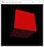
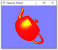
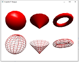

# A1 Report

Author: Zhongxin Hu (sign your name here)

Date: 2021/09/14   (insert the date)

Check [readme.txt](readme.txt) for lab work statement and self-evaluation. 

## Q1 Concepts of raster graphics (short answer)
	
### Q1.1 frame buffer

Frame buffer is part of Ram and designed to hold the grphic data of frame of image under raster display

### Q1.2 pixel

The most basic part of an raster image tons of pixels build up an raster image.

### Q1.3 color depth
the higher the color depth is the more aviable colors can be use and is the number bits of color of pixel used in frame buffer

### Q1.4 resolution

number of pixels

## Q2 Concepts of raster display (short answer)
	
### Q2.1 scan line

row of pixels

### Q2.2 refreshment & refresh rate

the reason we need refreshment in raster display is we want to draw new images and  a frame need to be refresehed before draw new frame

### Q2.3 frame
Its menas a full scan and display an image on screen

## Q3 Roles of CPU and GPU in CG (short answer)
	
### Q3.1 CPU roles
Generate the skeleton of the image and let the gpu do the rest

### Q3.2 GPU roles

calculate the graphics function such as graphic primitives with lighting effects and trasformations, its like rendering 

## Q4 C/C++ OpenGL programming environment (lab practice)
	
### Q4.1 C/C++ OpenGL installation
 
Complete? (Yes) 

If Yes, insert a screen shot image to show the completion.

{width=5%}
{width=5%}

If No,  Add a short description to describe the issues encountered.

### Q4.2 OpenGL C project
 
Complete? (Yes) 

If Yes, insert a screen shot image to show the completion.

{width=5%}

If No,  Add a short description to describe the issues encountered.

### Q4.3 OpenGL C++ project
 
Complete? (Yes) 

If Yes, insert a screen shot image to show the completion.

{width=5%}

If No,  Add a short description to describe the issues encountered.

**References**

1. CP411 a1
2. Add your references if you used. 
