# A2 Report

Author: Zhongxin Hu (sign your name here)

Date: 02/10/2021   (insert the date)

Check [readme.txt](readme.txt) for lab work statement and self-evaluation. 

## Q1 Graphics pipeline (short answer)
	
### Q1.1 Primitives

Write your answer here.
Graphic primitive is the base element of constructing complex image.
A graphic primitive is a graphics objcct
grapic piple will convert from the primitive model to the scene and to image in the frame buffer
### Q1.2 Coordinate systems & transformations

Model->Model transformations->3d world scene -> viewing transformation -> 3d view scene - > projection -> 2d/3d device scene - > rasterization->2d image
Systems:

Modeling Coordinate System 
World Coordinate System 
Normalized Device Coordinate System
Device Coordinate System or equivalently the Screen
Coordinate System

Transformations:

Modeling transforms
Viewing transforms (WCS to VCS)
Projection transforms (VCS to viewer’s plane, NDCS)
Display transformation (NDCS to DCS)

### Q1.3 Scan conversion

it will convert primitives to pixels to the frame buffer and for image generation

## Q2 OpenGL and Glut (lab practice)
	
### Q2.1 OpenGL primitives
 
Complete? (Yes/) 

If Yes, insert a screen shot image to show the completion.

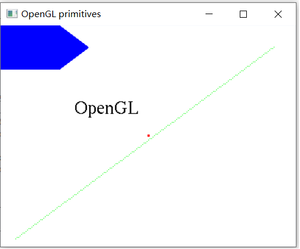{width=90%}

If No,  Add a short description to describe the issues encountered.

### Q2.2 Interactive graphics
 
Complete? (Yes/) 

If Yes, insert a screen shot image to show the completion.

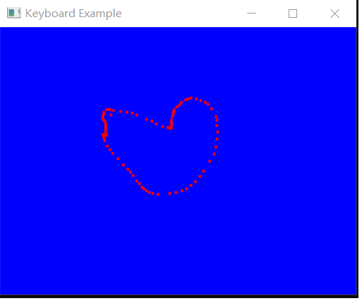{width=90%}

If No,  Add a short description to describe the issues encountered.

### Q2.3 Bitmap file I/O
 
Complete? (Yes) 

If Yes, insert a screen shot image to show the completion.

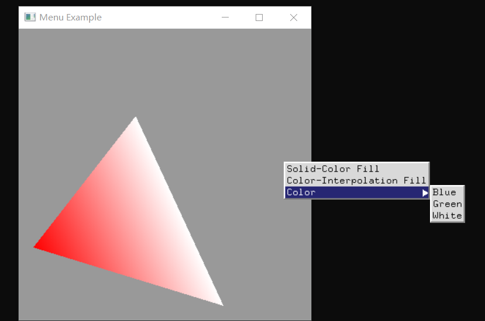{width=90%}

If No,  Add a short description to describe the issues encountered.

## Q3 SimpleDraw (programming)
	
### Q3.1 Display window and menu
 

Complete? (Yes) 

If Yes, insert a screen shot image to show the completion.

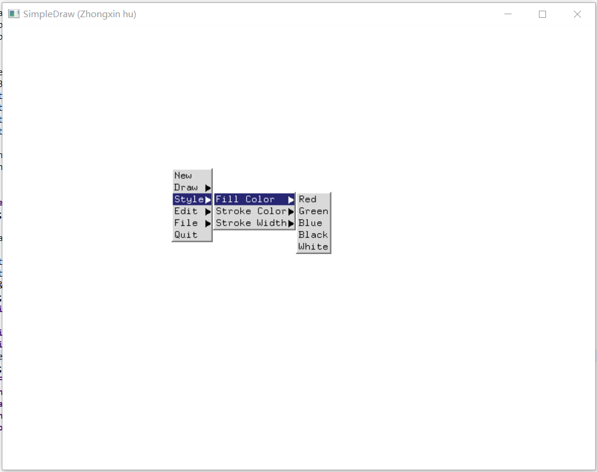{width=90%}

If No, add a short description to describe the issues encountered.

### Q3.2 Data structures
 

Complete? (Yes) 

If Yes, insert a screen shot image to show the completion.

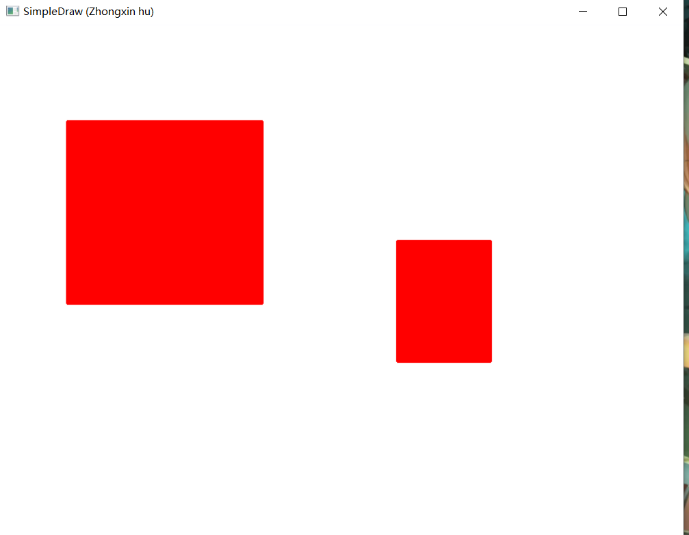{width=90%}

If No, add a short description to describe the issues encountered.

### Q3.3 Draw rectangles
 

Complete? (Yes) 

If Yes, insert a screen shot image to show the completion.

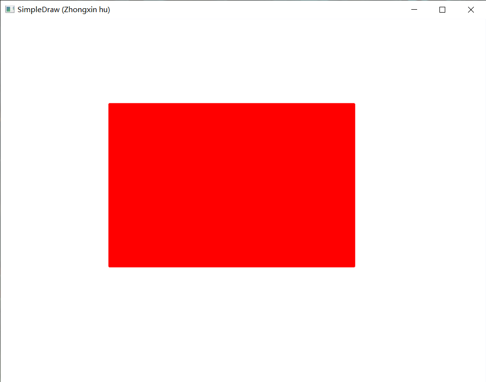{width=90%}

If No, add a short description to describe the issues encountered.

### Q3.4 Draw circles
 

Complete? (Yes) 

If Yes, insert a screen shot image to show the completion.

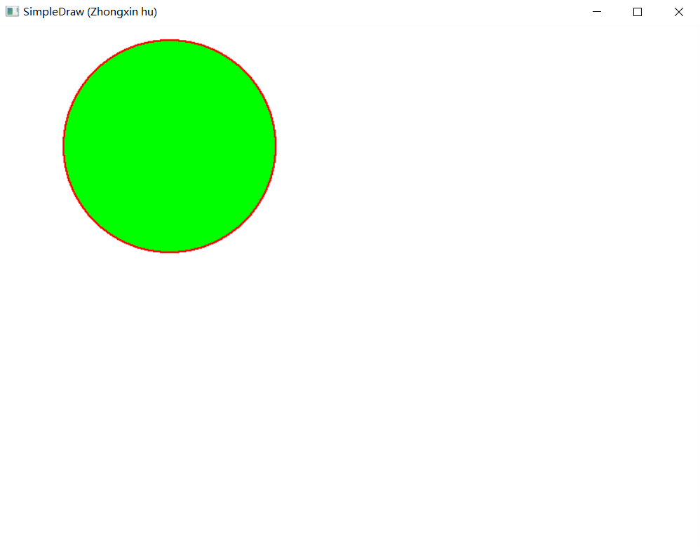{width=90%}

If No, add a short description to describe the issues encountered.

### Q3.5 Edit features
 

Complete? (Yes) 

If Yes, insert a screen shot image to show the completion.

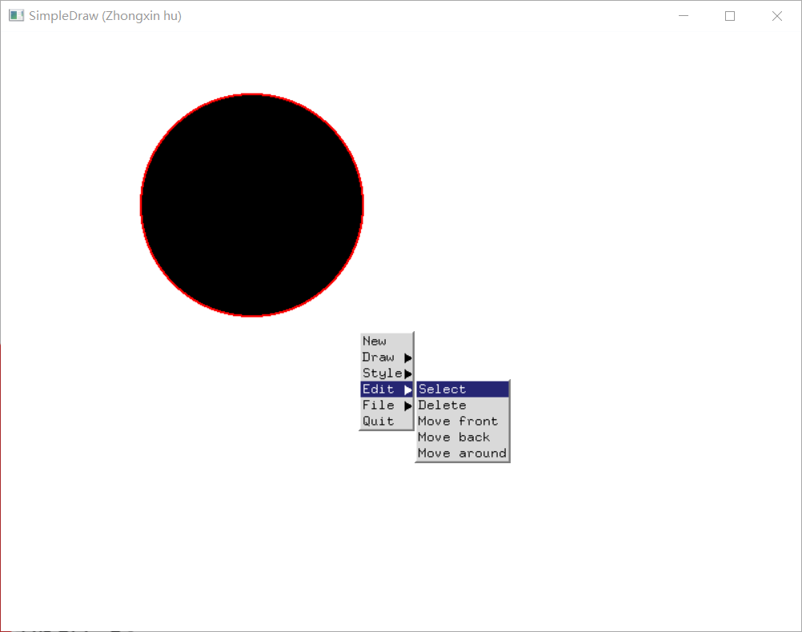{width=90%}

If No, add a short description to describe the issues encountered.

### Q3.6 Save/Open SVG files

Complete? (Yes).   If Yes, 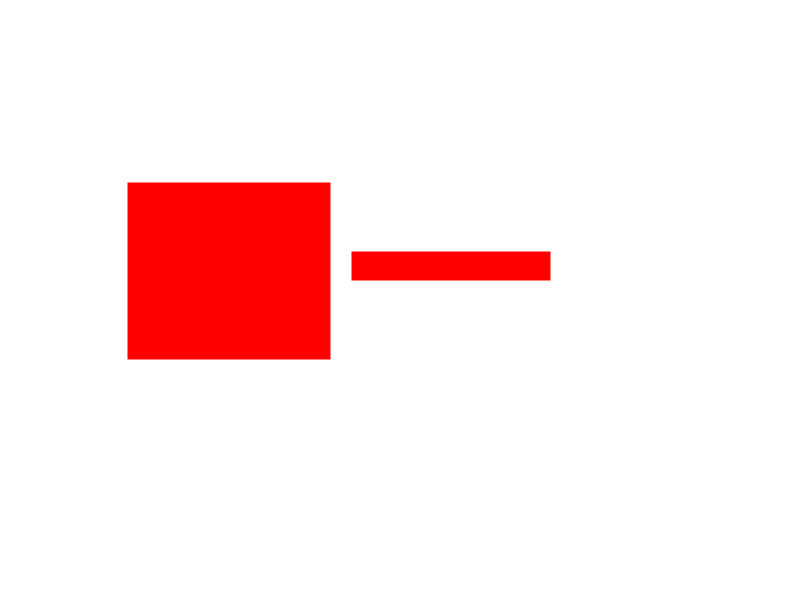.

### Q3.7 Export to bitmap

Complete? (Yes).   If Yes, .

### Q3.8 Circle&Square artwork

Complete? (Yes).   If Yes, 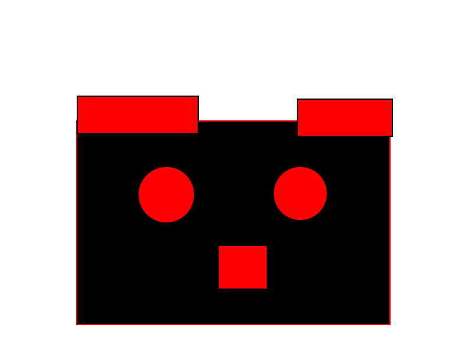, 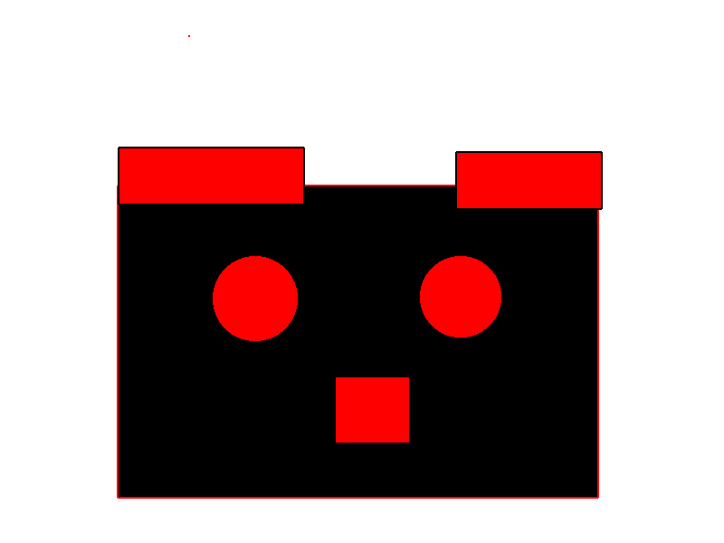.

**References**

1. CP411 a2
2. Add your references if you used. 
