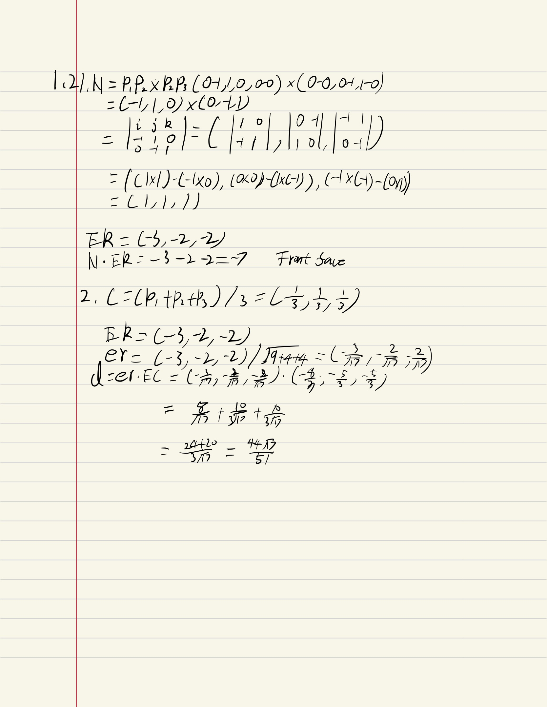
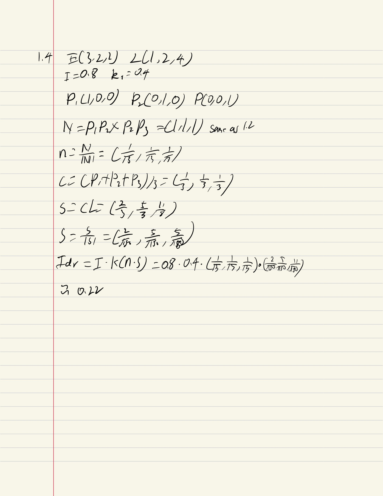
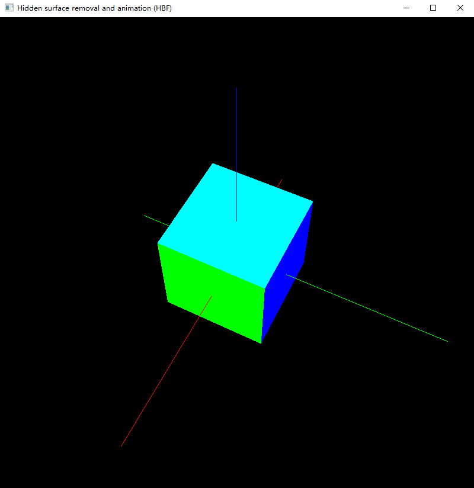
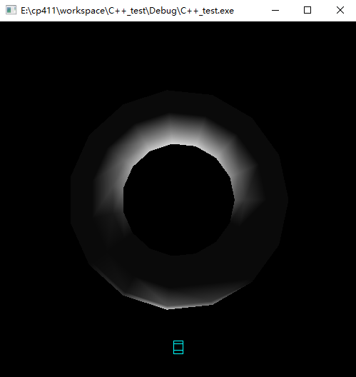
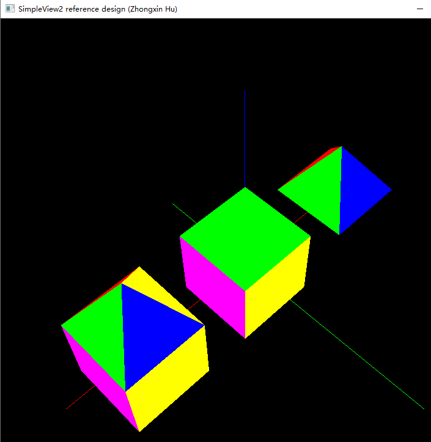
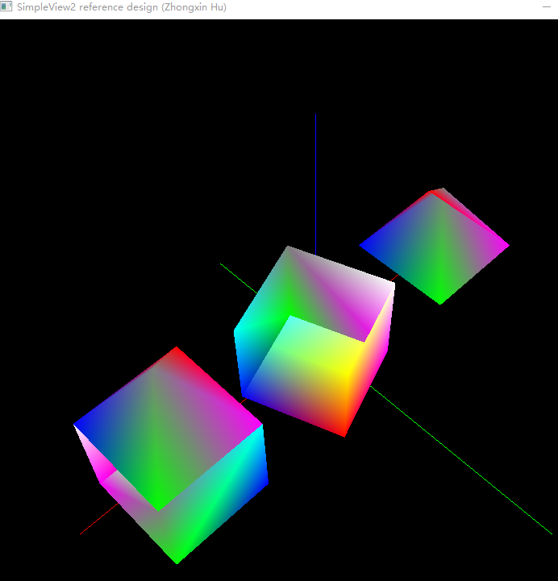
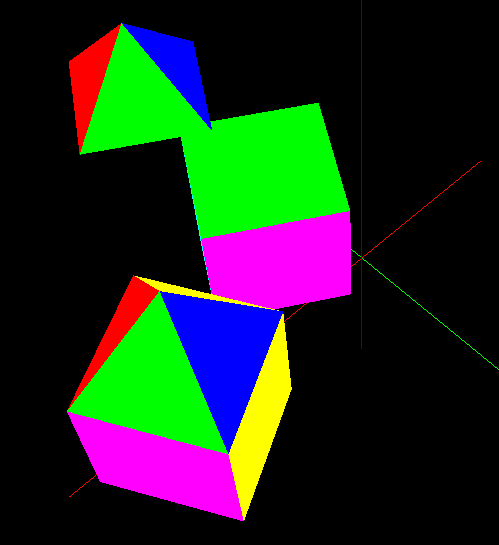

# A4 Report

Author: Zhongxin Hu (sign your name here)

Date: 09/11/2021   (insert the date)

Check [readme.txt](readme.txt) for lab work statement and self-evaluation. 

## Q1 Culling, Lighting, Shading (short_answer)
	
### Q1.1 Concepts of culling
Culling can cut the object's hidden face in the frame. Clipping will cull the polygons.
Object space is object based, it focuse on the geometrical relation to object .Image space is pixel based. 

### Q1.2 Culling computing

{width=90%}

### Q1.3 Concepts of lighting and shading

 1.Point light,Directional light,Ambient light,Material emission light.
 2.Use reflection of light to calcualte pixel color
 3.Constant shading,Gouraud shading,Phong Shading 
 4. Gouraud shading

### Q1.4 Lighting computing

{width=90%}

## Q2 OpenGL culling, lighting, shading (lab practice)
	
### Q2.1 Hidden surface removal
 
Complete? (Yes) 

If Yes, insert a screen shot image to show the completion.

{width=90%}

If No,  Add a short description to describe the issues encountered.

### Q2.2 Lighting and Shading
 
Complete? (Yes) 

If Yes, insert a screen shot image to show the completion.

{width=90%}

If No,  Add a short description to describe the issues encountered.

## Q3 SimpleView2 - culling, lighting, shading (programming)
	
### Q3.1 Culling
 

Complete? (Yes) 

If Yes, insert a screen shot image to show the completion.

{width=90%}

If No, add a short description to describe the issues encountered.

### Q3.2 Lighting
 

Complete? (Yes) 

If Yes, insert a screen shot image to show the completion.

{width=90%}

If No, add a short description to describe the issues encountered.

### Q3.3 Shading
 

Complete? (Yes) 

If Yes, insert a screen shot image to show the completion.

{width=90%}

If No, add a short description to describe the issues encountered.

### Q3.4 Animations
 

Complete? (Yes) 

If Yes, insert a screen shot image to show the completion.

{width=90%}

If No, add a short description to describe the issues encountered.

**References**

1. CP411 a4
2. Add your references if you used. 
